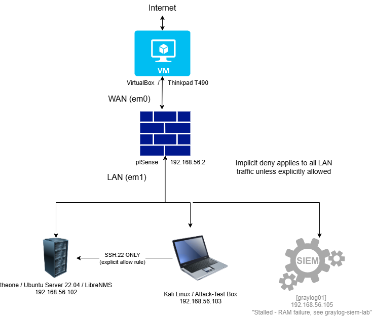

# pfSense Firewall Lab

Network segmentation and firewall policy build on top of an existing home lab (VirtualBox, Ubuntu Server, LibreNMS, Kali, Graylog). This project adds a pfSense firewall as the gateway between a simulated "outside" network and an internal lab segment, with default-deny inbound rules and log forwarding to Graylog.

> Status: 🚧 In progress — build log and troubleshooting notes below are updated as I go. Only errors I actually hit during this build are documented; nothing here is copy-pasted from someone else's writeup.

## Why this project

Monitoring (LibreNMS) tells you what's happening on the network. A SIEM (Graylog) tells you what happened. A firewall is the piece that actually *enforces* policy — deny by default, allow only what's needed. This project closes that loop: pfSense segments the lab, restricts what can talk to what, and forwards logs into Graylog so firewall events are visible in the SIEM alongside auth logs and other telemetry.

## Goals

* \[x] Stand up pfSense as a two-NIC gateway (WAN via NAT, LAN via host-only)
* \[x] Segment existing lab VMs behind the LAN interface
* \[x] Implement default-deny inbound rules; allow only explicitly needed services
* \[ ] Narrow graylog01's firewall rule from temporary "Any" to least-privilege (HTTP/HTTPS only)
*(blocked: Graylog install paused after a host hardware failure — see graylog-siem-lab repo for details)*
* \[ ] Forward pfSense logs to Graylog (`graylog01`)
* \[ ] (Stretch) Add Suricata/Snort for IDS/IPS on the WAN interface
* \[ ] Diagram the full lab architecture with pfSense as the segmentation point

## Lab architecture

**Planned topology:**

|Component|Role|Network|
|-|-|-|
|pfSense|Firewall / gateway|WAN: NAT · LAN: host-only|
|`theone` (Ubuntu Server, LibreNMS)|Monitored host|LAN (host-only)|
|`graylog01` (Graylog SIEM)|Log aggregation target|LAN (host-only)|
|Kali|Attack/test box|LAN (host-only), used to validate rules|

## Build log

|Date|Phase|Notes|
|-|-|-|
|2026-07-15|Note|graylog01's temporary "Any" rule remains unhardened pending completion of the Graylog install (paused due to a host hardware failure — see graylog-siem-lab repo).|
|2026-07-14/15|Disaster recovery|pfSense VM disk corrupted after improper shutdown (closed window mid-boot instead of clean halt). Rebuilt entirely from ISO using existing documentation as the guide - rebuild completed in under an hour versus the original multi-hour build.|
|2026-07-15|Post-rebuild verification|Recreated firewall rules (Kali -> theone SSH allow, default-allow disabled). Discovered Kali retained internet access due to a stray second NAT-attached adapter on the Kali VM bypassing pfSense entirely - not a firewall rule failure. Fixed by disabling the adapter. Reverified: ping/DNS blocked, SSH still works.|
|2026-07-12|Firewall rule policy (default-deny)|Added explicit allow rule: Kali (192.168.56.103) -> theone (192.168.56.102) TCP/22 only. Disabled default "allow LAN to any" rules (IPv4 + IPv6), relying on pfSense's implicit deny for everything else.|
|2026-07-12|Rule verification|Confirmed SSH from Kali to theone succeeds (explicit allow). Confirmed ping from Kali to theone fails, and Kali loses all internet access (implicit deny catching everything not explicitly permitted). Verified via firewall logs showing "Default deny rule" entries.|
|2026-07-10|VM creation + pfSense install|Created pfsense-fw VM (2GB RAM, 2 CPU). Hit and resolved several install-time errors (see troubleshooting.md).|
|2026-07-10|Interface assignment (WAN/LAN)|WAN=em0 (DHCP via VirtualBox NAT), LAN=em1 (static).|
|2026-07-10|LAN static IP + DHCP server|LAN set to 192.168.56.2/24 after resolving IP conflict with host. DHCP range 192.168.56.100-199.|
|2026-07-10|GUI access + admin password reset|Confirmed HTTPS web GUI access, changed default admin password.|
|2026-07-10|End-to-end connectivity test|theone (192.168.56.102) routed through pfSense to 8.8.8.8 and google.com, 0% packet loss, DNS resolving correctly.|
|2026-07-10|Kali connectivity verification|Confirmed Kali (192.168.56.x) routes through pfSense: gateway ping 0% loss, 8.8.8.8 0% loss, DNS resolution via google.com confirmed.|
||Inbound rule policy (default-deny)||
||Graylog log forwarding||
||IDS/IPS package (stretch)||

## Proof of Segmentation

**pfSense web GUI, logged in and configured:**

**Terminal and web GUI shown side-by-side, confirming the LAN IP conflict fix and successful login:**

**Kali restricted to SSH-only access — ping and internet access blocked, only theone SSH allowed:**

**LAN interface configuration in the pfSense console:**

**Diagnosing and resolving an IP conflict between pfSense LAN and the host machine:**

**Early troubleshooting — CPU long mode error during initial VM setup:**

## Troubleshooting

### "No route to host" during rule verification

**Date:** 2026-07-12
**Phase:** Rule verification

**Symptom:**
SSH from Kali to theone (192.168.56.102) returned "No route to host" immediately, even with a correctly configured allow rule.

**Cause:**
theone VM was powered off. Instant "No route to host" (rather than a hanging timeout) was the signal that this was a routing/reachability issue, not a firewall block — pfSense's silent deny behaves differently (no response, not an active error).

**Fix:**
Powered on theone, retested.

**Verification:**
SSH succeeded on retest.

Real errors hit during this build, in the order encountered. See `docs/troubleshooting.md` for full detail (symptom, cause, fix, and how it was verified).

Six issues encountered and resolved during the pfSense install and configuration — see full writeups in the linked file.

*(Empty for now — populated as issues come up during the actual build.)*

## Security+ concepts demonstrated

* Network segmentation / zoning
* Default-deny (implicit deny) rule design — verified experimentally, not just configured
* Principle of least privilege — single explicit allow rule (SSH only) rather than broad permissions
* NAT vs routed interfaces
* Defense in depth (firewall + SIEM + monitoring working together)
* (Stretch) IDS/IPS signature-based detection

## Related lab projects

* [LibreNMS Network Monitoring Lab](#) — link once published
* [Graylog SIEM Build](#) — link once published

## Disclosure

This lab was built with AI assistance (Claude) for guidance, troubleshooting support, and documentation structure. All commands were run and all errors documented here were personally encountered and reproduced in this environment.

